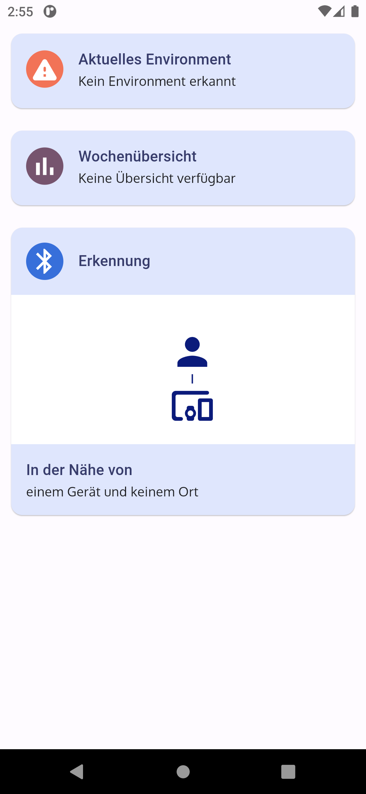

# beaconscious

This Flutter application is a (visual) prototype of an environment based Digital Wellbeing and Smart Home Automation application. The detection of an environment would be based on configured, nearby bluetooth devices (_where?_) and time ranges (_when?_). Upon detecting an environment, user defined rules are triggered (_what?_). Examples of such rules include the restriction of certain app usage and notifications.

## Screenshots

### Home Screen

The home screen shows an overview of all essential information. This includes the currently detected environment, as well as a short analysis overview for this environment and a detection view.

### Detection Screen

The detection screen gives an overview over all the detection devices and locations. Depending on the type, the detailed card may include information about the bluetooth name, strength and so on.

### Analysis Screen

In the analysis screen the user is presented information about his behavior. This corresponds to the detected environments. Relative comparisons are extended using interesting usage facts. (e.g. **user worked at saturday in home office**)

## Videos

### Configuring an Environment

The video shows how a user could configure an environment by specifying the devices to be detected, the time to consider and the actions to take. Finally a user can simple deactivate an environment, if temporarily needed.

### Adding an Environment

The video shows how a user could add an environment into the application.

### Deleting an Environment

The video shows how a user could delete an environment from the application.

### Adding a detection device

The video shows how a user could add a device for detection into the application.

